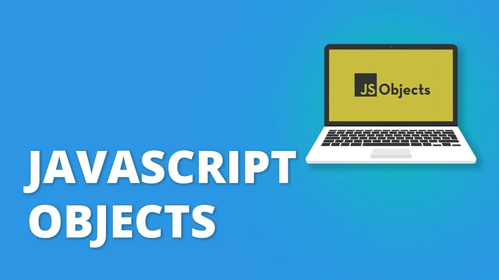

# Everything You Need to Know About Objects in JavaScript



Objects are important data structures in JavaScript, partly because arrays are objects in JavaScript, and you’ll use them all the time. Objects are crucial for grouping data and functionalities, enabling you to accomplish a lot with them in JavaScript. DOM nodes, including those created with createElement, are examples of objects in JavaScript.

## What is an Object in JavaScript?

Objects in JavaScript are a kind of data structure that holds data in the form of key-value pairs. Suppose we wish to hold data about a person and have some details about that person. Using an object to do that would look like this:

```

{
  firstName: "Harry",
  lastName: "Potter",
  age: 11,
  gender: "male",
  schoolName: "Hogwarts School of Witchcraft and Wizardry",
  friends: ["Ron Weasley", "Hermione Granger"]
}

```

The above code represents an object holding data about a person named Harry Potter. It is enclosed inside curly braces and consists of key-value pairs separated by commas. The keys come before the colon, and the values come after it. In this example, the keys are firstName, lastName, age, gender, schoolName, and friends.

Objects in everyday life have properties and “method” actions. For example, a fan is an object with properties such as make, color, or model, and actions it can perform such as cooling rooms and controlling humidity.

As explained, objects in JavaScript are core data structures comprising properties and methods. While methods are functions/actions an object can perform, properties are characteristics of an object such as its name and value. Objects allow you to group related data together and split code into logical pieces. In JavaScript, we have primitive values and reference values. Number, Boolean, Null, Undefined, String, and Symbol are primitive values, while objects like DOM nodes, Arrays, etc., are reference values.

In both real life and JavaScript, you can use objects in different ways depending on their properties and methods. Now let’s delve deeper into JavaScript objects.

## How to Create an Object in JavaScript

We’ll use the code below as an example:

```

const person = {
  name:'kamal',
  age:30,
  friends:[
     'Shola','Ade','Ibraheem'
  ],
  greet:function(){
    alert('Hello World')
  }
}

```

## Object Creation

In the above code, we created a person object using curly braces. The object contains key-value pairs. You can store key-value pairs in a JavaScript object, associating each key with a unique value. These key-value pairs allow you to retrieve values using the associated keys. Each property becomes a key-value pair with the property name as the key and the property value as the value. Both properties and methods are created inside the object.

To create a key in an object, you don’t need a let or const keyword. Because objects are dynamic, you can add or change properties without declaring a variable. Rather, you start with your preferred name, a colon, and then your value.

We created an array of friends inside the object to demonstrate that we can have an object inside another object. We also created a method (which is a function) inside the object with greet as the key.

## Using Object Literal Syntax

This is the most popular way to create an object in JavaScript. In this way, we create a JavaScript object by enclosing it within curly braces {}.

```

let laptop = {
  brand: "Apple",
  model: "MacBook Air",
  operatingSystem: "MacOS"
};

```

The above code snippet creates a JavaScript object named laptop using curly braces. Within the curly braces, three properties are mentioned, separated by commas and written over multiple lines with indentation to enhance readability.

## Using Object Constructor Function

This way uses the Object constructor along with the new keyword:

```

let laptop = new Object(); // This creates an empty object

// Now we will add properties to the object
laptop.brand = "Alienware";
laptop.model = "m15";
laptop.operatingSystem = "Windows 11 Home";

console.log(laptop);
//→ {brand: "Alienware", model: "m15", operatingSystem: "Windows 11 Home"}

```

The above code creates an empty object using new Object(). Then, we add three properties to this empty object. The resultant object is identical to the one created using the object literal syntax.

## Using the Object.create Method

This method is used when we wish to inherit properties from an existing object while creating a new object.

```

let animal = {
  diet: null,
  saySomething: function(word) { console.log(word); }
};

let cat = Object.create(animal);

console.log(cat.diet);
//→ null

cat.saySomething("Meeow");
//→ Meeow

```

In the above code snippet, the object cat inherits the properties diet and saySomething() from the object animal while the former object is being created. The object animal acts as the parent object, and cat is the child object. Changing the child property diet’s value does not affect the corresponding property for the parent object.

## Using Object.assign Method

This method is used when we wish to include properties from multiple other objects into the new object we are creating.

```

let lesson = {
  lessonName: "Data Structures"
};

let teacher = {
  teacherName: "Himmat Singh"
};

let course = Object.assign({}, lesson, teacher);

console.log(course);
//→ {lessonName: "Data Structures", teacherName: "Himmat Singh"}

```

In the above example, we create a new object named course and include all properties from two objects — lesson and teacher — into it. The properties from the source objects get copied to the target object {}, resulting in the object variable course.

## How to Create Object Copies in JavaScript

Unlike primitive data types such as strings and numbers, assigning an existing object to another variable will not produce a copy of the original but rather a reference in memory. This means that both the original object and subsequent objects created by assigning the original object as a value are referencing the same item in memory. Consequently, a change in the value of any of the objects will also cause a change in the others. For example:

```

let object4 = {
    name: "Alex",
    age: 40
};
let object5 = object4;
console.log(object5); //{name: 'Alex', age: 40}
object4.name = "Jane";
console.log(object5); //{name: 'Jane', age: 40}
console.log(object4 === object5); //true

```

To create a copy of an object, you can use the spread operator.

## How to Add Properties to an Object

There are two major approaches to adding properties to an object in JavaScript. The first is to create a brand-new object:

```

let person = {
  name:'kamal',
  age:30,
  friends:[
     'Shola','Ade','Ibraheem'
  ],
  greet:function(){
    alert('Hello World')
  }
}

person = {
  ...person,
  isAdmin:true
}

```

With the above code, we created the first person object using the let keyword, allowing us to reassign it to a new value. We then added the "isAdmin" property to the person object.

The second approach is to add properties using dot notation:

```

const person = {
  name:'kamal',
  age:30,
  friends:[
     'Shola','Ade','Ibraheem'
  ],
  greet:function(){
    alert('Hello World')
  }
}

person.isAdmin = true;

```

## Why use the let Keyword Over Dot Notation?

The choice between using the let keyword and dot notation depends on whether you need to create a new object reference or modify an existing one. You would use the let keyword to create a new object when you need to create a new reference to an object, separate from any existing references to similar objects. On the other hand, you would use dot notation to add or modify properties on an existing object reference. This is useful when you want to make changes to an object without creating a new reference.

## How to Update Properties of a JavaScript Object

Updating a property of an object is similar to adding a property. To update a property, simply assign the new value to the object’s property using dot notation or bracket notation. For example:

```

let superhero = {
  name: "Batman",
  alias: "Bruce Wane"
};

superhero.alias = "Bruce Wayne"; // using dot notation

console.log(superhero.alias); //→ Bruce Wayne

```

Both dot notation and bracket notation can be used interchangeably for updating properties.

## How to Delete Properties in an Object

Deleting a property in an object is simple in JavaScript. The delete keyword allows you to discard any properties you wish:

```

const person = {
  name:'kamal',
  age:30,
  friends:[
     'Shola','Ade','Ibraheem'
  ],
  greet:function(){
    alert('Hello World')
  }
}
person.isAdmin = true;
delete person.friends;
console.log(person);

```

## Checking if a Property Exists on an Object in JavaScript

There are two ways to check whether a property exists on an object or not. Each way has its usage.

## Using hasOwnProperty() Method

The hasOwnProperty() method is used to check for an own property on an object. Its syntax is: objectName.hasOwnProperty("propertyName"). If the specified property is an own property for the object, then the above expression would be true, otherwise, the expression would be false. Let's see an example:

```

let father = {
  lastName: "Kohli"
};

let son = Object.create(father); // object son inherits all properties from object father

// adding an own property to son
son.firstName = "Virat";

console.log(son.hasOwnProperty("firstName"));
//→ true

console.log(son.hasOwnProperty("lastName"));
//→ false

```

The hasOwnProperty() method is used to check for own properties only. In the above example, the property "firstName" is an own property, hence true is logged. On the other hand, for the inherited property "lastName", false is logged, since an inherited property is not an own property. The property name in the expression objectName.hasOwnProperty("propertyName") is written within double quotes.

## Object Spread Operator

The object spread operator is a popular and powerful syntax in JavaScript. The spread operator takes all the key-value pairs of an object and copies the key name and value into a new object. An object is a reference value, and if you want a copy of the object without pointing to the same property in memory, the spread operator is the answer.

```

let person = {
  name: 'kamal',
  age: 30,
  hobbies: [
     'reading', 'playing', 'sleeping'
  ]
}
console.log(person);
const person2 ={...person};
console.log(person2.age);

```

The syntax for the object spread operator goes between the opening and closing brackets. Then there should be three dots and the object you want to spread into this object. You can use the spread operator to copy the values of any iterable including objects.

## How to Iterate Over Objects in JavaScript

Use a for…in loop to iterate over an object and to select its properties. The for..in loop syntax is as follows:

```

for(let key in object) {
    //perform action(s) for each key
}

```

The key keyword in the syntax above is a parameter for the properties. So you can replace it with any word of your choice. Replace the object keyword with the name of the object you want to iterate over. For example:

```

let objectZ = {
    name: "Ade",
    Pronoun: "he",
    age: 60
};
for(let property in objectZ) {
    console.log(`${property}: ${objectZ[property]}`)
}

```

Output:

```

name: Ade
Pronoun: he
age: 60

```

Notice the use of bracket notation in the loop to get the values of the property. Using dot notation instead of bracket notation would return undefined.

## Using this for Object References

The this keyword is generally used inside the body of a method. this keyword references the object through which the method has been invoked. Let's take a look at an example to have clarity about its usage:

```

let wizard = {
  firstName: "Harry",
  lastName: "Potter",
  fetchFullName: function() {
    return this.firstName + " " + this.lastName;
  }
};

```

The above code snippet defines an object to have three properties, out of which one is a method named “fetchFullName”. We see in the method’s body that the this keyword has been used. Now, whenever the method "fetchFullName" is invoked by using the expression wizard.fetchFullName(), the this keyword present inside the body of the method will point to the object wizard since this object is invoking the method. Hence, the expression this.firstName and this.lastName, present inside the method's body, refer to the properties "firstName" and "lastName" for the object wizard, respectively. So, we get:

```

console.log(wizard.fetchFullName());
//→ Harry Potter

```

ones again, What is the this keyword? this is a specific keyword in JavaScript which is most important when used inside of a function in an object. But you can use it anywhere in your code aside from the function body of an object.

this is a powerful keyword used in referencing the current object in which it's used.

```

let person = {
  name:'kamal',
  age:30,
  greet:function(){
    return `My name is ${this.name}, and my age is ${this.age} years old`;
  },
}
console.log(person.greet());
// My name is kamal, and my age is 30 years old.

```

The code above demonstrates that the this keyword refers to the object containing the function, in this case, the "person" object, and the result displays the output of the "greet" function.

Regardless of its location within an object, the this keyword always refers to the entity that executed the function in the code. Using this in different contexts within the code can produce distinct results. For instance:

```

let person = {
  name:'kamal',
  age:30,
  greet:function(){
    return `My name is ${this.name}, and my age is ${this.age} years old`;
  },
}
console.log(this);

```

The output of the code shows that the this keyword when console.logged will print a window object.

## Defining Getters and Setters in JavaScript Object

Getters and setters are special kinds of JavaScript methods that do not require parentheses to get invoked. More importantly, getters and setters are used to access and mutate (change) object properties, respectively. In the previous section on the ‘this’ keyword, we took a wizard object example, where we had a method fetchFullName that helped us get the full name of the wizard. This "fetchFullName" method concatenated the "firstName" and "lastName" properties to produce the wizard's full name. Now, what if we wish to set the "firstName" and "lastName" properties, given the wizard's full name? Can we do it?

Yes, we can, using getters and setters. A getter will be used to access the full name of the wizard, using the “firstName” and “lastName” properties. On the other hand, the setter will be used to change the “firstName” and “lastName” properties of the wizard, given the wizard’s full name. But before implementing a getter and setter for our wizard, we need to know how to define a getter and a setter, in general.

Getter is defined by prepending the keyword get to the method name. Moreover, when we define a getter within the object's curly braces, we do not define it as a key-value pair; instead, we just write it as a function. Having said that, now let's see how a getter is written:

```

let objectName = {
  get functionName() {
    // function's body
  }
};

```

Now, coming to the setter. A setter is defined by prepending the keyword set to the method name. Just like a getter, when we define a setter within the object's curly braces, we do not define it as a key-value pair; instead, we just write it as a function:

```

let objectName = {
  set functionName(value) {
    // function's body
  }
};

```

Setters generally have a parameter since we need to pass in a value for modifying the object’s properties. Now, we can implement a getter and setter for our object wizard.

```

let wizard = {
  firstName: "Harry",
  lastName: "Potter",

  get fullName() {
    return this.firstName + " " + this.lastName;
  },

  set fullName(value) {
    this.firstName = value.split(" ")[0];
    this.lastName = value.split(" ")[1];
  }
};

```

It is worthwhile to note from the above code snippet that both getter and setter have the same name. Now let’s see how to invoke the getter:

```

console.log(wizard.fullName);
//→ Harry Potter

```

We can notice from the above code snippet that invoking a getter does not require parentheses. Giving parentheses while invoking the getter will result in a TypeError. Now let’s see how to invoke the setter so that we can modify the “firstName” and “lastName” properties:

```

wizard.fullName = "Hermione Granger"; // this statement invokes the setter

console.log(wizard.firstName);
//→ Hermione

console.log(wizard.lastName);
//→ Granger

```

So, we notice two things from the above code snippet. First, we do not require parentheses while invoking the setter. Second, the “firstName” and “lastName” properties for the object wizard get modified.

## Required properties for JavaScript objects methods

In JavaScript, every object has different methods, and some of the handy methods are shown below:

### Object.create()

The Object.create() creates a new empty object which we can use later and add different keys and values to it. It takes one argument which can be null or an empty JavaScript object. As shown in the example below:

```

const object = Object.create({});
console.log(object); // {}

```

As shown in the example, I created an empty object using the Object.create().

### Object.keys()

The Object.keys() takes an object as an argument and returns an array containing all the keys from the object which was passed in the Object.keys(). This method is mostly used for checking if a certain key is present in the object or if the object is empty or not. As shown in the example below:

```

const user = {
 name: 'Amol shelke',
 isLoggedIn: true,
}
console.log(Object.keys(user));
//output ['name', 'isLoggedIn']

```

### Object.values()

The Object.values() is similar to Object.keys(); the only difference between them is that Object.keys() returns an array containing only the keys, and on the other side, Object.values() returns only the values present in the object. As shown in the example below:

```

const user = {
 name: 'Amol shelke',
 isLoggedIn: true,
}
console.log(Object.values(user));
//output ['Amol shelke', 'true']

```

As shown in the example above, the Object.values() returns an array containing only the values.

### Object.entries()

The Object.entries() takes an object as an argument and returns an array containing keys and values at the same time, separated by a comma. And if the Object is empty, it will return an empty array as a result of calling the Object.entries() on any object. As shown in the small example below:

```

const user = {
 name: 'Amol shelke',
 isLoggedIn: true,
}
console.log(Object.entries(user));
//output [['name', 'Amol shelke'], ['isLoggedIn', 'true'] ]

```

### Object.assign()

The Object.assign() copies all the key values from one source object which we passed inside Object.assign() and returned a new object with those keys and values. It takes two arguments, the first one to which object we want to assign the values and the second one from which object the keys and values should be taken. A small example is shown below for more about the Object.assign():

```

const user = {
 name: 'Amol shelke',
 isLoggedIn: true,
}
const newUser = {}; // empty object
Object.assign(newUser, user);
console.log(newUser); //Output {name: 'Amol shelke', isLoggedIn: true}

```

In the above example, we are copying the user object keys and values and assigning them to the new User object with the help of Object.assign(). This method is beneficial for copying an object without writing some long algorithm for copying an object.

### Object.freeze()

As the name says, the Object.freeze() freezes the object on which the method is being called, which means one cannot perform addition or modification of new properties on the existing object. For more details, have a look below at the example:

```

const user = {
  name: "AMOL",
  age: 18,
};
const freezeObject = Object.freeze(user);
freezeObject.name = "amol";
console.log(freezeObject);
// the output: {name: 'AMOL', age: 18}

```

As shown in the example, After calling the Object.freeze() on the user object, the user object is frozen, even after trying to change the name property from the user object, the result I get is the old user object.

### Object.seal()

The Object.seal() is the same as Object.freeze() as it also does the same. After applying this method to the existing object, new properties and values cannot be added, but one can change the existing properties of the object.

```

const user = {
  name: "AMOL",
  age: 18,
};
const sealObject = Object.seal(user);
freezeObject.name = "amol";
console.log(sealObject);
// the output: {name: 'amol', age: 18}

```

As shown in the code example, even after using Object.seal(), the object is modified, so you should use Object.freeze() when you want a strictly frozen object.

Object.getProtoTypeOf() The Object.getProtoTypeOf() returns the prototype of an object. As shown in the example below:

```

const user = {
  name: "AMOL",
  age: 18,
};
console.log(Object.getProtoTypeOf(user));
// it will log a big prototype object to the console

```

## Conclusion

In JavaScript, objects are probably the most important data type. Programming concepts like Object-Oriented programming work on the principle of leveraging the flexibility of objects to store complex values and their distinct capability of interacting with properties and methods within the object. This article lays a solid foundation for understanding such advanced concepts by explaining the basics of objects.
