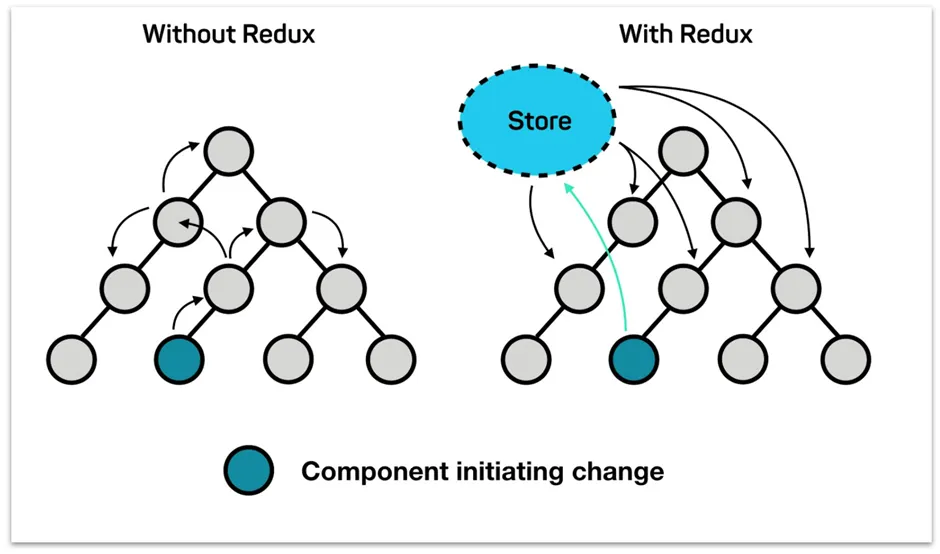
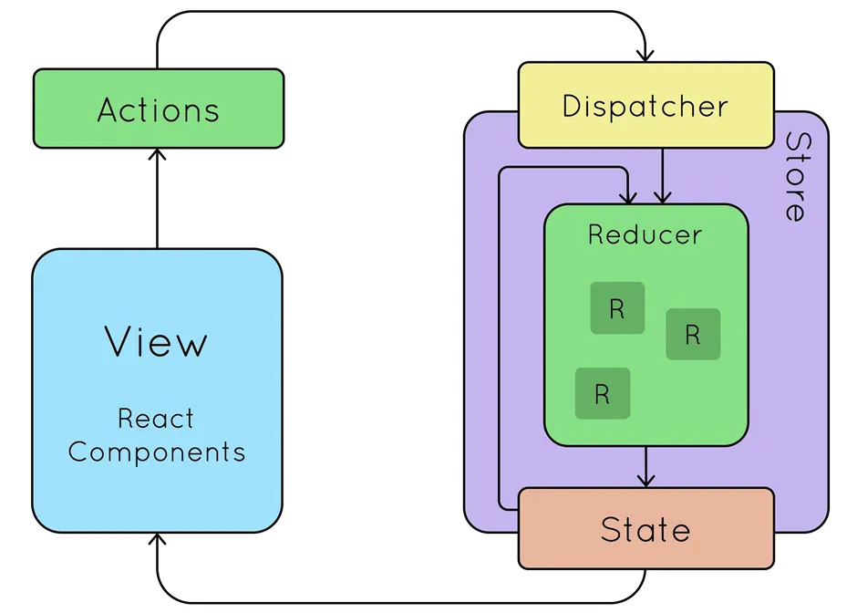

# Exploring Redux with React: From Basics to Advanced with Redux Toolkit


## What is Redux

Most web developers would probably have heard of Redux, a popular state management library. It first came to the front-end world in 2015 as the revolutionary state management solution built by Dan Abramov and Andrew Clark. In front-end frameworks like React, Angular, or Vue, each component internally manages its own states. As the app gets more complex, managing states across many components becomes tedious and difficult. Redux became the solution to this issue.

Redux works by providing a centralized ‘store’, which holds all the states within the app. Each component in the app can access this store without having to pass props around in the component tree.



Imagine you are building a house and need to keep track of all the materials you use and how much money you spend. Instead of keeping track of everything in your head or on a piece of paper, you could use a ledger to keep track of every transaction. Redux works similarly by keeping track of your application’s state in a single place called the “store.”

Let’s say you’re building an e-commerce site. You may need to keep track of the items in a user’s cart, their payment information, and their shipping details. Instead of passing this information from component to component using props, Redux allows you to store them in one central location where they can be easily accessed and updated. This makes it easier to manage complex states and keep your application organized. It’s important to note that Redux is not limited to React, and you can use it with other frameworks or even vanilla JavaScript.

## Why Should I Use Redux?

Redux can help simplify the state management process, especially when dealing with complex and interconnected components. Here are some reasons why you might want to use Redux in your application:

Centralized state management: With Redux, you can maintain the state of your entire application in a single store, making it easier to manage and access data across components.
Predictable state updates: Redux has a clear flow of data, which means changes to the state can only happen when you create an action and send it through Redux. This makes it easy to understand how your application’s data will change in response to user actions.
Easier debugging: With Redux DevTools, you have a clear record of all the changes to your application’s state. This makes locating and fixing issues in your code easier, saving you time and effort in the debugging process.
Better performance: By minimizing the number of state updates and reducing the need for prop drilling, Redux helps improve your application’s performance.

## How Does Redux Work?

As previously mentioned, Redux enables you to maintain a single centralized store that manages the state of your entire application. All components in your application can access this store and update or retrieve data from it as needed. The key components that enable this centralized approach to state management are:

1. Store
2. Actions
3. Dispatch
4. Reducers

Let’s explore the role of each one:

### The Store

The Redux store is like a giant container that holds all the data for your application. Think of the store as a box with different compartments for different data types. You can store any data you want in these compartments, and it can hold various kinds of data, such as strings, numbers, arrays, objects, and even functions. Also, the store is the single source of truth for your application’s state. This means that any component in your application can access it to retrieve and update data.

### Actions

An action is an object that describes what changes need to be made to the state of your application. It sends data from your application to the Redux store and serves as the only way to update the store. An action must have a “type” property describing the action being performed. This “type” property is typically defined as a string constant to ensure consistency and avoid typos. In addition to the “type” property, an action can have a “payload” property. The “payload” property represents the data that provides additional information about the action being performed. For example, if an action type is ADD_TASK, the payload might be an object containing a new task item’s “id”, “text”, and “completed status”.

Here’s an example of an action:

```

{
  type: 'ADD_TASK',
  payload: {
    id: 1,
    text: 'Buy groceries',
    completed: false
  }
}

```

Note that to create actions, we use action creators. Action creators are functions that create and return action objects. Here is an example of an action creator that takes in a task’s text and returns an action object to add the task to the Redux store:

```

function addTask(taskText) {
  return {
    type: 'ADD_TASK',
    payload: {
      id: 1,
      text: taskText,
      completed: false
    }
  }
}

```

An appropriate analogy for actions and action creators would be a chef using a recipe. The recipe outlines the required ingredients and instructions to prepare a dish, similar to how an action in Redux specifies the needed details to modify the state of an application. In this scenario, the chef represents the action creator, who follows the recipe to create the dish, similar to how an action creator creates an action based on predefined properties.

### Dispatch

In Redux, dispatch is a function provided by the store that allows you to send an action to update the state of your application. When you call dispatch, the store runs an action through all of the available reducers, which in turn update the state accordingly. You can think of dispatch as a mail carrier who delivers mail to different departments in a large company. Just like how the mail carrier delivers mail to different departments, dispatch delivers actions to various reducers in your Redux store. Each reducer is like a department in the company that processes the mail and updates its own part of the company’s data.

### Reducers

In Redux, a reducer is a function that takes in the current state of an application and an action as arguments and returns a new state based on the action. Here’s an example of a simple reducer:

```

const initialState = {
  count: 0
};

function counterReducer(state = initialState, action) {
  switch(action.type) {
    case 'INCREMENT':
      return { ...state, count: state.count + 1 };
    case 'DECREMENT':
      return { ...state, count: state.count - 1 };
    default:
      return state;
  }
}

```

In the above code, we have a simple reducer called “counterReducer” that manages the state of a count variable. It takes in two arguments: state and action. The state argument represents the current state of your application, while the action argument represents the action dispatched to modify the state. The reducer then uses a switch statement to check the “type” of the action, and based on that type, it updates the state accordingly. For example, if the action type is “INCREMENT”, the reducer returns a new state object with the count incremented by 1. Also, if the action type is “DECREMENT”, the reducer returns a new state object with the count decremented by 1.

A perfect analogy for a reducer would be a kitchen blender. Just like a blender takes in different ingredients, blends them, and produces a smooth mixture, a reducer takes in the current state of an application and an action, processes them together, and produces

### The Redux Flow

The typical Redux flow is as follows:

1. A user interacts with the View to trigger a state update.
2. When a state update is required, the View dispatches an action.
3. The reducers receive the action from the dispatch and update the state in the Store according to what is described by the action.
4. The View is subscribed to the Store to listen for state changes. The changes are notified via the subscription methods, and the View updates its UI accordingly.

## Advantages of Redux Toolkit

Redux Toolkit provides several advantages over traditional Redux:

- It is easier to set up and requires fewer dependencies.
- Reduces boilerplate code by allowing the creation of a single file known as a “slice” that combines actions and reducers.
- Provides sensible defaults for commonly used features, such as Redux Thunk and Redux DevTools. This means that you don’t have to spend time configuring these features yourself, as they are already built into Redux Toolkit.
- It uses the immer library under the hood, which enables direct state mutation and eliminates the need for manually copying the state {...state} with every reducer.
- Less boilerplate code than Redux.
- You don’t have to set up thunk manually in Redux Toolkit as it comes with createAsyncThunk. This enables you to perform async operations.
- Enhancing developer experience: Redux Toolkit includes a number of tools and utilities that can enhance the developer experience, such as the ability to use Redux DevTools out-of-the-box.
- Redux hooks like useSelector and useDispatch make your code shorter and easier to read/write.
- Improving performance: Redux Toolkit includes a built-in memoization feature that can help improve the performance of your Redux application by reducing unnecessary re-renders.



In summary, Redux Toolkit is a great choice for developers who want to simplify their Redux code and improve performance, while also enhancing the developer experience. It can be particularly useful in larger, more complex applications where managing state can become difficult.

## How to Get Started with Redux Toolkit

For this project, you won’t use create-react-app to create your React app. Instead, you'll use Vite and React plugins. This is because CRA is no longer recommended by the React docs.

To create your app, run the code below in your terminal:

```

npm create vite@latest my-app --template react

```

Next, run the following commands in the terminal:

```

cd my-app
npm install
npm run dev

```

### How to install Redux Toolkit

To make use of Redux Toolkit in your project, run the code below in your terminal:

```

npm install @reduxjs/toolkit react-redux

```

### How to create a Redux store

After the installation is complete, create a file named src/redux/store.jsx. Import configureStore from Redux Toolkit and then create an empty Redux store which will be exported as shown in the code below:

```

import { configureStore } from '@reduxjs/toolkit'

export const store = configureStore({
  reducer: {},
})

```

This code creates a Redux store and also automatically configures the Redux DevTools extension so that you can inspect the store while developing.

### How to connect the Redux Store to React

After you’ve created the store, you will have to wrap your <App/> with a <Provider/> which will be imported from react-redux. Also, the store you created above will be passed into the provider as a prop.

```

//main.js
import React from 'react'
import ReactDOM from 'react-dom'
import './index.css'
import App from './App'
//Importing the store we created above
import { store } from "./redux/store"
//importing the provider from react-redux
import { Provider } from 'react-redux'

ReactDOM.render(
    //This makes the store accessible to the App that is passing it as a prop
  <Provider store={store}>
    <App />
  </Provider>,
  document.getElementById('root')
)

```

### How to create a Redux state slice

After the store has been created, create a file src/redux/countslice.jsx. Then import createSlice from @redux/toolkit.

A Redux slice is a concept introduced by Redux Toolkit that represents a self-contained piece of the Redux store that includes a reducer function, initial state, and action creators.

Slices provide a way to organize and modularize Redux code, making it easier to manage and maintain as your application grows. You can think of slices as mini-Redux stores that handle a specific piece of state within your application.

Creating a slice requires three things:

- Name, which is usually set to be a string.
- Initial State Value.
- Reducer, which contains actions that define how the state can be updated.

Creating a state slice creates a more modular and maintainable architecture for your application, making it easier to reason about and update as your application grows.

By organizing your Redux code into slices, you can create a more modular and maintainable architecture for your application, making it easier to reason about and update as your application grows.

After you create the slice, the reducers and the Redux actions inside the reducers are exported differently. This is because the slice created will need to be exported before it can be used inside the store.

By exporting the reducer from the slice, you can easily use it to configure your Redux store. It also makes it easy to test the reducer in isolation, without needing to set up a full Redux store. This can be useful for unit testing and ensuring that the reducer behaves as expected for each action it handles.

```

import { createSlice } from '@reduxjs/toolkit'

const initialState = {
  count: 0,
}

export const counterSlice = createSlice({
  name: 'counter',
  initialState,
  reducers: {
    increment: (state) => {
      state.count += 1
    },
    decrement: (state) => {
      state.count -= 1
    },
    incrementByAmount: (state, action) => {
      state.count += action.payload
    },
  },
})

// Action creators are generated for each case reducer function
export const { increment, decrement, incrementByAmount } = counterSlice.actions

export default counterSlice.reducer

```

## How to add the slice to the store

The Reducer exported from the slice is imported and added to the store you created earlier. This allows you to complete the configuration of the store.

```

//store.jsx
import { configureStore } from '@reduxjs/toolkit'
//Importing the reducer from countSlice
import counterReducer from "./countslice"

export const store = configureStore({
  reducer: {
    counter: counterReducer,
  },
})

```

### How to use the state and actions in your React components

Up until now, you’ve just been going through the initial setup for Redux Toolkit, setting up the store and creating the reducer. Now you need to start making use of the state and actions in your app to achieve the desired functionality.

You will be using two hooks: useDispatch and useSelector. Data is being read from the store through the useSelector hook while the actions are being dispatched using the useDispatch hook.

The corresponding actions (increment, decrement, and incrementByAmount) are being imported from the countSlice.jsx file to be used by the dispatch.

Take a look at the code below where the state is set to a variable count using the useSelector hook and the actions are set to a variable dispatch using the useDispatch. There are three buttons: the increase button, decrease button, and increaseByAmount button. An onClick event was placed on each button which runs the various actions.

When these buttons are clicked, two things happen:

- The Redux action is dispatched to the store.
- The slice reducer will see the action and then update the state.

```

//App.jsx
import React from 'react'
import { useSelector, useDispatch } from 'react-redux'
import { decrement, increment, incrementByAmount } from "./redux/countslice"

export default function App() {
  const count = useSelector((state) => state.counter.count)
  const dispatch = useDispatch()

  return (

      <div className='App'>
        <h1>The count is {count}</h1>
        <div className="button">
        <button
          onClick={() => dispatch(increment())}
        >
          Increase
        </button>
        <button
          onClick={() => dispatch(decrement())}
        >
          Decrease
        </button>
        <button onClick={()=>dispatch(incrementByAmount(10))} > Increase by 10</button>

        </div>

      </div>

  )
}

```

## Conclusion

If you’ve followed along with this tutorial, you should now have a solid understanding of Redux, both the traditional approach and the simplified version using Redux Toolkit. I hope you found this article helpful and informative. I know it was a lot of material to cover, but I hope it serves as a comprehensive resource for beginners and intermediate learners seeking to learn Redux.
