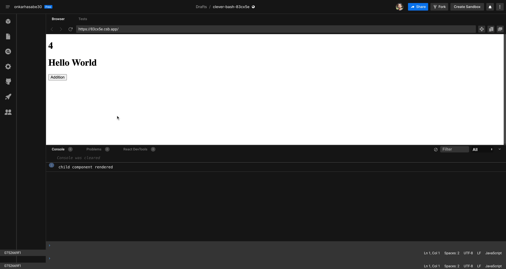

# Mastering React Performance Optimization with useMemo and useCallback


Hello react developers, In this article, we’ll explore two important React Hooks: useMemo and useCallback. These Hooks are essential for enhancing the performance of your components, preserving objects between React component renderings, and optimizing your application.

## React Performance Optimizations

React already provides React.memo() to prevent the recreation of DOM elements when props remain unchanged. However, it doesn't automatically memoize typical JavaScript functions, which means functions may be recreated with each use.

The main difference between the useMemo and useCallback hooks is what they return: useMemo returns a memoized value, and useCallback returns a memoized function. Let's delve into the specifics with some examples to clear up any confusion.

#3 What is useMemo?

In some scenarios, you might need to include complex calculations in your React components. These complex calculations are inevitable and may slow down the rendering process. If you have to re-render a component that handles a costly calculation to update another view result (not the result of the costly calculation), the costly calculation may get triggered again, ultimately causing performance issues. This is where useMemo comes to the rescue.

The useMemo Hook serves a similar purpose as useCallback, but it returns a memoized value instead of a function reference. This allows you to avoid repeatedly performing potentially costly operations until necessary. The useMemo Hook typically returns a cached value until a dependency changes. When a dependency changes, React re-does the expensive calculation and updates the memoized value.

## Understanding useMemo

To illustrate, consider a situation where you want to memoize the result of a costly calculation in your React component. You can use useMemo as follows:

```

import React, { useState, useMemo } from 'react';
import ChildComponent from './ChildComponent';

function App() {
  const [num, setNum] = useState(0);

  const memoizedChildComp = useMemo(() => <ChildComponent />, []);

  return (
    <div>
      <h1>{num}</h1>
      {memoizedChildComp}
      <button onClick={() => setNum(num + 1)}>Addition</button>
    </div>
  );
}

```

In this example, you’ll notice that the console statement doesn’t get printed when you click the “Addition” button. This demonstrates how useMemo can improve performance by memoizing the child component in this scenario.



## What is useCallback?

When React re-renders a component, function references inside the component get re-created. If you pass a callback function to a memoized (using React.memo) child component via props, it may get re-rendered even if the parent component's props appear unchanged. Each parent component re-rendering phase creates new function references for callbacks. Therefore, unequal callback props can silently trigger an unwanted re-render of the child component, even when visible props haven't changed.

The useCallback Hook returns a memoized function reference based on a function and a dependencies array. This allows you to create optimized callbacks that don't cause unnecessary re-renders. The useCallback Hook returns a cached (memoized) function reference when dependencies haven't changed.

## Understanding useCallback

To demonstrate the use of useCallback, consider a scenario where you want to pass a callback function to a child component without causing unnecessary re-renders. Here's how you can achieve this with useCallback:

```

import React, { useState, useCallback } from 'react';
import ChildComponent from './ChildComponent';

function App() {
  const [num, setNum] = useState(0);

  const handleUpdateNum = useCallback(() => {
    // Some code
  }, []);

  const memoizedChildComp = useMemo(
    () => <ChildComponent handleUpdateNum={handleUpdateNum} />,
    [handleUpdateNum]
  );

  return (
    <div>
      <h1>{num}</h1>
      {memoizedChildComp}
      <button onClick={() => setNum(num + 1)}>Addition</button>
    </div>
  );
}

```

In this example, you’ll notice that even after changing the parent component’s state, the child component doesn’t re-render. This is because useCallback returns a memoized function, ensuring that the function reference remains the same across re-renders.


## Pros and Cons of Using useMemo and useCallback

To better understand the advantages and disadvantages of using these Hooks for performance optimization in your React apps, refer to the following table:

### Pros of useMemo:

- Helps cache values to prevent costly recalculations.
- Compatible with built-in memoization for child components using computed objects.
- An inbuilt and stable React core feature suitable for production use.
- Offers a simple function interface with only two parameters: a function and a dependencies array.

### Cons of useMemo:

- Adds some syntax complexity for computing functions, potentially complicating your code.
- Beginners might misuse this Hook in situations where caching isn’t necessary, impacting code readability and memory usage.
- Excessive usage can lead to memory-related performance issues.

### Pros of useCallback:

- Helps cache functions to prevent excessive child component re-renders.
- Allows for improved use of memo built-in’s performance enhancements.
- An inbuilt and stable React core feature suitable for production use.
- Offers a simple function interface with only two parameters: a function and a dependencies array.

### Cons of useCallback:

- Adds some syntax complexity for callback definition, potentially complicating your code.
- Beginners may find this Hook confusing, as it caches a function, not a simple value.
- Excessive usage can lead to memory-related performance issues.

## Memoization

Memoization is an optimization technique that can significantly enhance React’s performance by optimizing the rendering process. React provides built-in mechanisms for memoization, which enhance performance by caching results and returning the cached result when the same inputs are encountered again.

In a React app, memoization ensures that child components re-render only when there’s a change in their props, preventing unnecessary re-renders when props or state values don’t frequently change. React also offers hooks for memoizing functions and values, such as useCallback and useMemo, which can avoid re-creating or re-calculating them in every render.

The benefits of using memoization in React include:

- Improving performance by reducing the number of DOM operations and avoiding expensive computations.
- Preserving referential equality, ensuring the same object or function instance is returned across renders.
- Avoiding side effects or bugs caused by unnecessary re-rendering or re-execution of functions dependent on external factors.

However, there are some challenges and drawbacks to consider:

- Adding complexity and overhead to your code by introducing extra hooks or components.
- Selecting the right dependencies for memoization to ensure correctness and prevent stale values.
- Managing cache invalidation and memory usage to avoid memory leaks and outdated results.

## Referential Equality

Referential equality is a crucial concept in React that impacts how often your components re-render. React re-renders a component only when there’s a change in its state variables or props. To determine if a change has occurred, React uses the Object.is() comparison algorithm to compare the new value against the old value for equality.

Object.is() checks for referential equality when dealing with objects, meaning it checks if they point to the same object instance in memory. Understanding referential equality is crucial when working with objects in React, especially when using hooks like useEffect, useCallback, or useMemo, as they rely on referential equality to determine if an effect or a memoized value should be updated. When passing an object as a dependency to these hooks, it's essential to ensure that the object reference doesn't change in every render to avoid unnecessary re-rendering or re-execution of your effects or memoized values.
