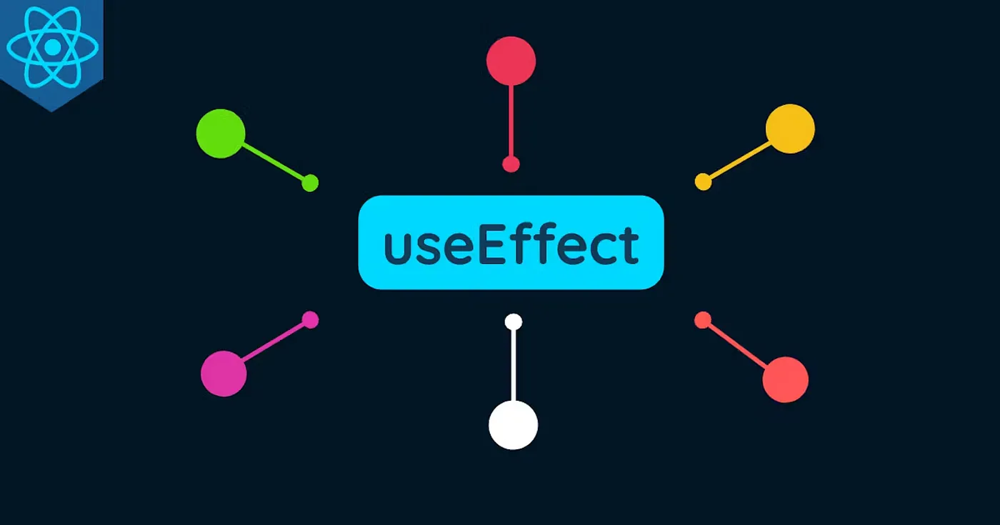

# The React Hook Series: Exploring useEffect in Details



## What is useEffect?

If you are coming from the class-based React, the useEffect Hook replaces the componentDidMount, componentDidUpdate, and componentWillUnmount lifecycle methods.

In simple terms, useEffect helps us to deal with side effects like data fetching and state or variable changes for React functional components. It takes 2 arguments:

A function that will instruct what to run when a state changes
A dependency array that can contain a list of variables that tells the Hook to run every time its value is updated. If not supplied, the Hook will run after every render.
Let’s see how it works.

### Initialization

The very first step is to import the Hook:

```

import React, { useEffect } from 'react';

```

To use the Hook, simply add it to the top level of the function component:

```

useEffect(() => {
    console.log('This runs after every render');
});

```

In this example, the Hook will run after every render.

## Runs Once on First Render

If you want the Hook to run only once on first render, we can add an empty array as its dependency like so:

```

useEffect(() => {
    console.log('This runs once on first render');
}, []);

```

By supplying an empty array as the second argument, this tells the Hook to listen for zero state changes. Hence, it will only run once.

## Runs On a Specified Dependency

To make the Hook run on a particular state change, we can supply the variable as a dependency in the array.

```

useEffect(() => {
    console.log("Count variable has changed!")
}, [count]);

```

In this example, the Hook will run on first render and after every time the variable count has changed its value.

### What about for multiple variable changes?

If we want the Hook to run every time after multiple variable changes, simply add them to the array like so:

```

useEffect(() => {
    console.log("Some count variable has changed!")
}, [count, count1, count2]);

```

## Important Things to Note

Now that we have learned the basics of this Hook, let’s look at some important things to note about useEffect.

### 1. Dependencies

The dependencies supplied in the array as the second argument of useEffect must be variables from the component scope such as props or state.

#### Changing Dependencies Too Often

While dependencies allows optimization for the Hook, it can cause issues when the values change too often, as mentioned in the React Documentation. Take a look at the example below.

Our Counter component uses the useState hook to declare a variable named count. And a useEffect hook is used to increment the count state by interval. However, by supplying count as a dependency, the interval will be reset every time the hook is re-run

```
function Counter() {
  const [count, setCount] = useState(0); // initialize count

  useEffect(() => {
    const id = setInterval(() => {
      setCount(count + 1); // effect updates and depends on count
    }, 1000);
    return () => clearInterval(id);
  }, [count]);  // Hence count must be specified as a dependency

  return <h1>{count}</h1>;
}

```

To fix this, we should supply an empty array dependency and updatecount without setCount referencing its current state as shown below.

```

function Counter() {
  const [count, setCount] = useState(0);

  useEffect(() => {
    const id = setInterval(() => {
      setCount(c => c + 1); // Doesn't depend on count outside
    }, 1000);
    return () => clearInterval(id);
  }, []); // useEffect doesn't use any variable dependencies

  return <h1>{count}</h1>;
}

```

## 2. Runs After Render

useEffect runs after a prop, state or context changes. It runs after every render, unless specified by the dependency array. Instead of thinking in terms of lifecycle methods like in class-based React, it is better to think about what effect should happen on the component after the re-render.

## 3. useEffect Returns

It is important to note that the useEffect hook can only return a function for cleanup or null. If you try to use an async function inside the hook, it may return an error because the hook returns a Promise and not null.

## Conclusion

And that’s the gist of this hook! Thanks for reading this article. I hope it was helpful for React beginners. Please feel free to ask questions in the comments below. Ultimately, practicing and building projects with this hook will help anyone to pick it up faster.
